# Laboratorio 5: Clasificacion de tweets usando mineria de texto

---

**Universidad del Valle de Guatemala**
**CC3084 -- Data Science -- Semestre II 2026**

**Integrantes:**
 Mendez Alvarado, Pablo Jose
 Yee Vidal, Maria Jose

**Repositorio:** https://github.com/Paul-1511/lab5data.git

---

## Indice

1. Descripcion del problema y datos
2. Calidad de los datos
3. Preprocesamiento y limpieza
4. Analisis exploratorio de datos
5. Frecuencias y n-gramas
6. Nubes de palabras
7. Prevencion de fuga de datos
8. TF-IDF y representacion del texto
9. Modelos, hiperparametros y seleccion
10. Evaluacion en holdout
11. Funcion de clasificacion
12. Analisis de sentimiento (VADER)
13. Ablacion con negatividad
14. Conclusiones, limitaciones y recomendaciones
15. Bibliografia

---

## 1. Descripcion del problema y datos

El objetivo es clasificar si un tweet se refiere a un desastre real (`target=1`) o no (`target=0`), utilizando tecnicas de mineria de texto. El dataset proviene de la competencia Kaggle *Natural Language Processing with Disaster Tweets*.

| Archivo | Filas | Descripcion |
|---------|-------|-------------|
| `train.csv` | 7,613 | Datos etiquetados (id, keyword, location, text, target) |
| `test.csv` | 3,263 | Datos sin etiqueta para prediccion final |
| `sample_submission.csv` | 3,263 | Plantilla de envio |

La distribucion de clases en `train.csv` es: 4,342 tweets no-desastre (57.0%) y 3,271 desastre (43.0%). El desbalance es moderado y se aborda con `class_weight="balanced"` en los clasificadores.

## 2. Calidad de los datos

### Valores faltantes

Las columnas `id`, `text` y `target` estan completas. `keyword` tiene 61 nulos (0.8%) y `location` tiene 2,533 nulos (33.3%). Se usa `text` como variable principal; `keyword` y `location` se conservan para EDA pero no entran al modelo para evitar dependencia de metadatos ausentes en produccion.

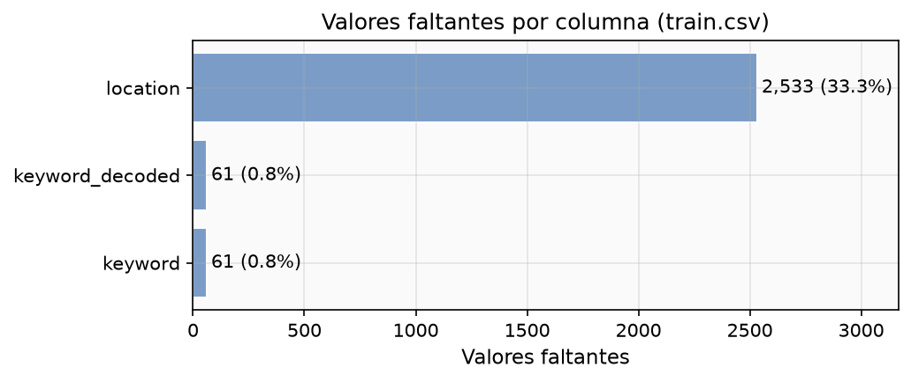

### Duplicados

Se identificaron dos tipos de duplicados:

 **Exactos:** tweets con identico texto crudo que comparten etiqueta.
 **Normalizados:** tras aplicar `.strip().lower()`, textos que parecen iguales pero tienen etiquetas diferentes (contradictorios).

Se encontraron 16 grupos con etiquetas contradictorias (ver `outputs/eda/tables/contradictory_labels.csv`). Ejemplos notables: *"To fight bioterrorism sir."* aparece con target 0 y 1 segun la copia; *"Hellfire is surrounded by desires..."* tambien fluctua. Estos casos son ruido inherente al etiquetado humano.

**Decision:** no se eliminan duplicados, pero todos los textos identicos (normalizados) se asignan al mismo grupo para que caigan juntos en train o test durante la validacion cruzada (seccion 7).

### Etiquetas proxy

La columna `keyword` correlaciona fuertemente con `target` en ciertos valores (e.g., *"suicide bomber"* tiene tasa de desastre cercana a 100%). Usarla como feature seria fuga de datos. Se excluye del pipeline de modelado.

## 3. Preprocesamiento y limpieza

Se implementaron dos niveles de limpieza:

| Nivel | Funcion | Uso |
|-------|---------|-----|
| Analisis | `clean_for_analysis` | EDA, n-gramas, nubes de palabras |
| Modelo | `clean_for_model` | Input para TF-IDF |

### Decisiones de limpieza para el modelo (`clean_for_model`)

 **URLs:** eliminadas (`https?://\S+`). No aportan semantica al clasificador.
 **Menciones:** reemplazadas por espacio (`@\w+`). Los nombres de usuario son ruido.
 **Hashtags:** se conserva el texto eliminando solo el simbolo `#` (`#earthquake` se convierte en `earthquake`). Los hashtags frecuentemente contienen vocabulario relevante.
 **Negaciones:** se conservan. Se definio un conjunto explicito `NEGATIONS` que se excluye de la lista de stopwords. Palabras como *"not"*, *"never"*, *"don't"* invierten el significado y son cruciales para la interpretacion.
 **Numeros:** se conservan en `clean_for_model`. Tokens como *"911"* o *"5"* (en contextos como *"5 dead"*) pueden ser informativos cuando el vectorizador los combina con palabras adyacentes.
 **Emoticonos y puntuacion:** eliminados por `clean_for_model` (regex `[^a-z0-9\s]`), pero preservados en el texto original para el analisis VADER (seccion 12), donde son esenciales.
 **Minusculas:** se aplica `.lower()` para normalizar.
 **Apostrofes:** eliminados para evitar fragmentacion (`don't` se convierte en `dont`, que esta en `NEGATIONS`).

### Decision sobre emoticonos y puntuacion para VADER

VADER fue disenado para texto informal de redes sociales. Los emoticonos (`:)`, `:(`) tienen scores propios en su lexico. Las mayusculas amplifican la valencia (*"HORRIBLE"* recibe mayor intensidad que *"horrible"*). La puntuacion repetida (`!!!`) refuerza la intensidad. Las negaciones (`not good`) invierten la polaridad del siguiente token. Eliminar estos elementos degradaria la calidad del analisis de sentimiento.

## 4. Analisis exploratorio de datos

### Distribucion de target

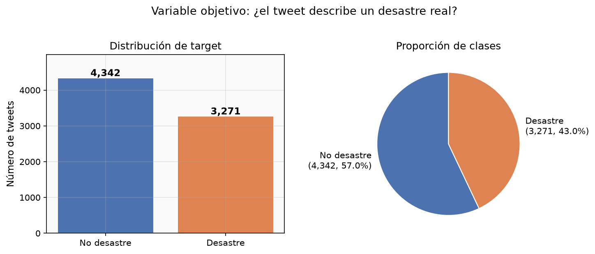

El dataset presenta desbalance moderado: 57% no-desastre vs 43% desastre. No requiere tecnicas agresivas de remuestreo; `class_weight="balanced"` ajusta los pesos inversamente proporcionales a la frecuencia de clase.

### Longitud de texto por clase

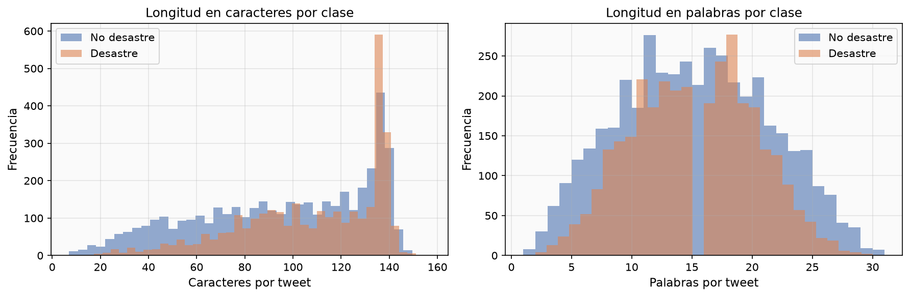

Los tweets de desastre tienden a ser ligeramente mas largos. La mediana de caracteres es mayor para `target=1`, probablemente porque reportan hechos concretos (ubicacion, cifras, fuentes).

### Elementos de texto por clase

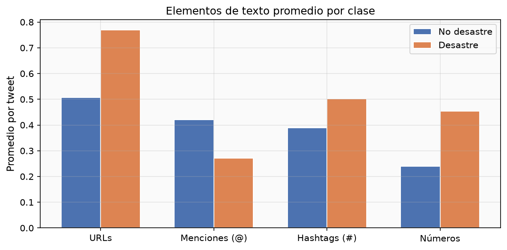

Se contaron URLs, menciones, hashtags y numeros por tweet. Los tweets de desastre tienen mas URLs (enlaces a noticias) y numeros (cifras de victimas, magnitudes). Los tweets de no-desastre tienen mas menciones (conversaciones informales).

### Keywords y tasa de desastre

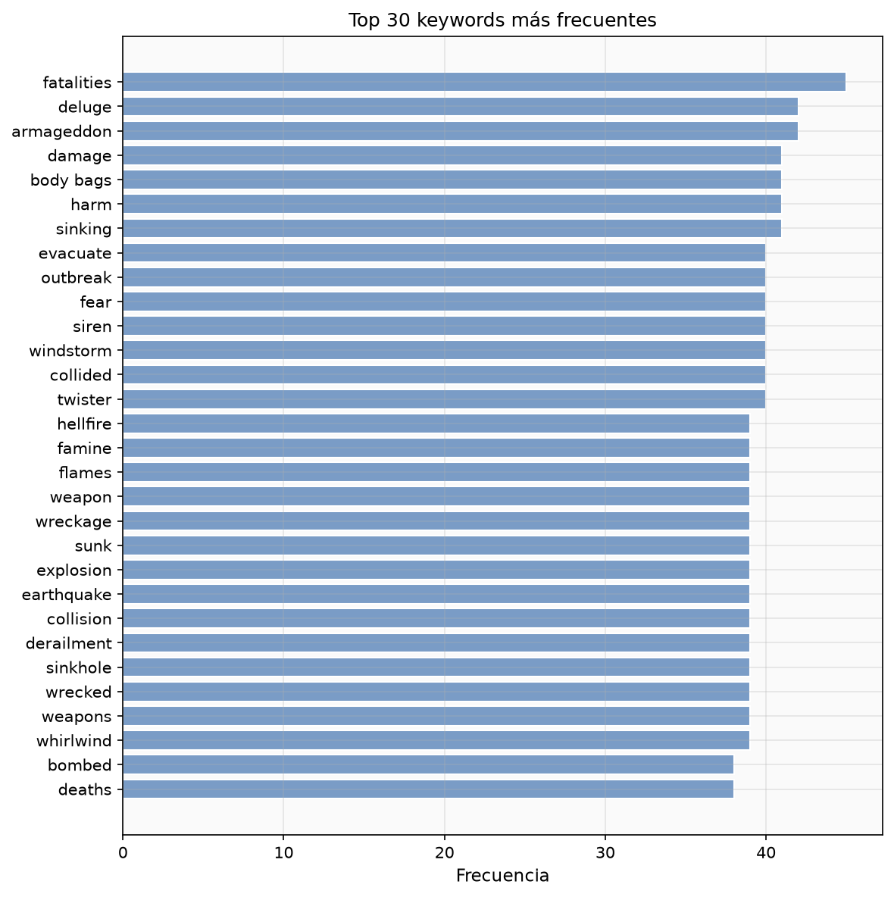

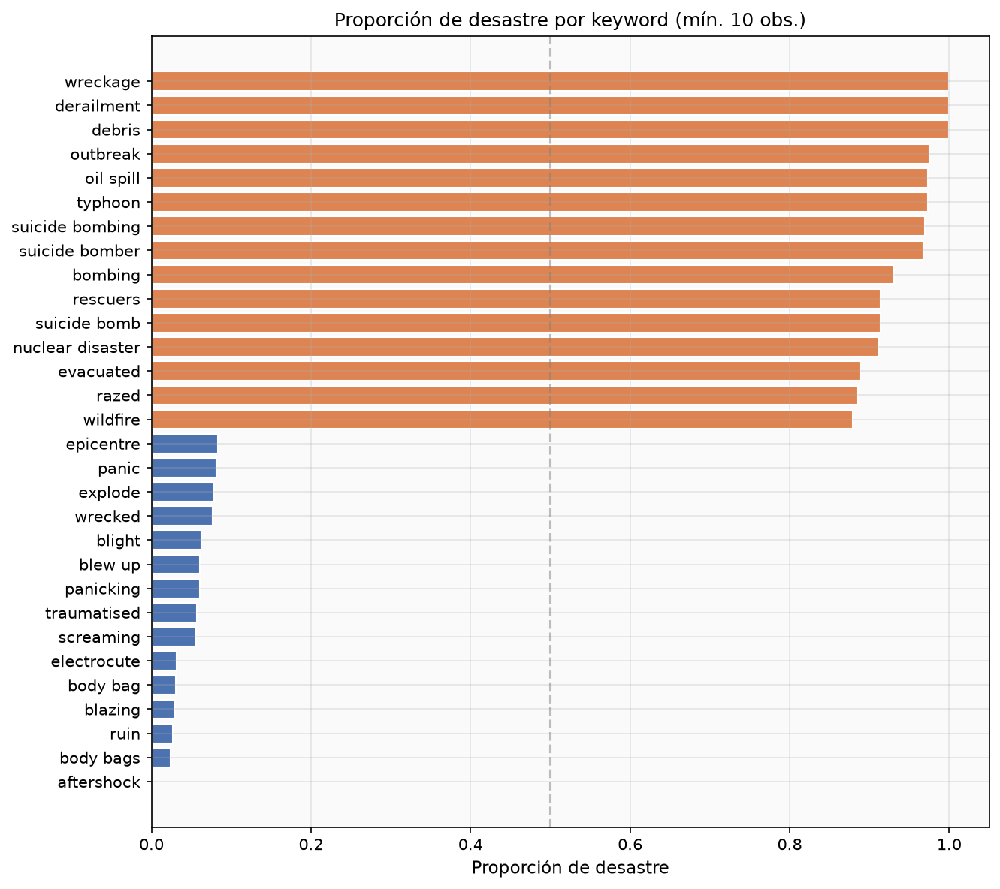

Keywords como *"derailment"*, *"debris"*, *"wreckage"* tienen tasas cercanas al 100%. Keywords como *"body bags"*, *"sinking"* son mas ambiguas (uso metaforico frecuente). Ver tabla completa en `outputs/eda/tables/disaster_rate_by_keyword.csv`.

### Ubicaciones

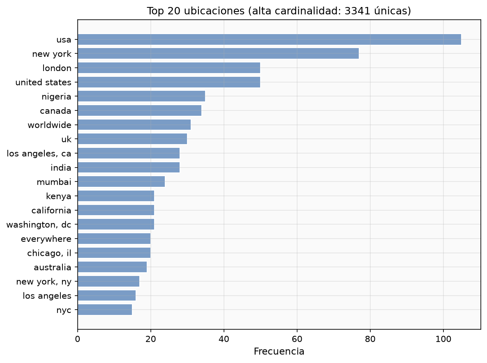

Las ubicaciones mas frecuentes incluyen *USA*, *New York*, *London*, *California* y *Washington, DC*. La columna tiene 33.3% de nulos y formato libre (no estandarizado), lo que limita su utilidad como feature.

## 5. Frecuencias y n-gramas

Se calcularon frecuencias de unigramas, bigramas y trigramas por clase, utilizando **log-odds ratio suavizado** (Laplace, alpha=1) como medida de caracter distintivo.

### Unigramas

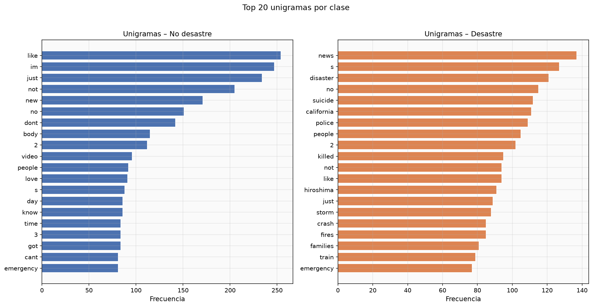

 Unigramas mas distintivos de desastre: *"news"*, *"killed"*, *"attack"*, *"bomb"*.
 Unigramas mas distintivos de no-desastre: *"im"*, *"like"*, *"just"*, *"dont"*, *"love"*.
 Unigramas ambiguos: *"fire"*, *"no"*, *"people"* aparecen en ambas clases con frecuencias similares.

Ver tabla completa: `outputs/eda/tables/unigrams_by_class.csv`.

### Bigramas

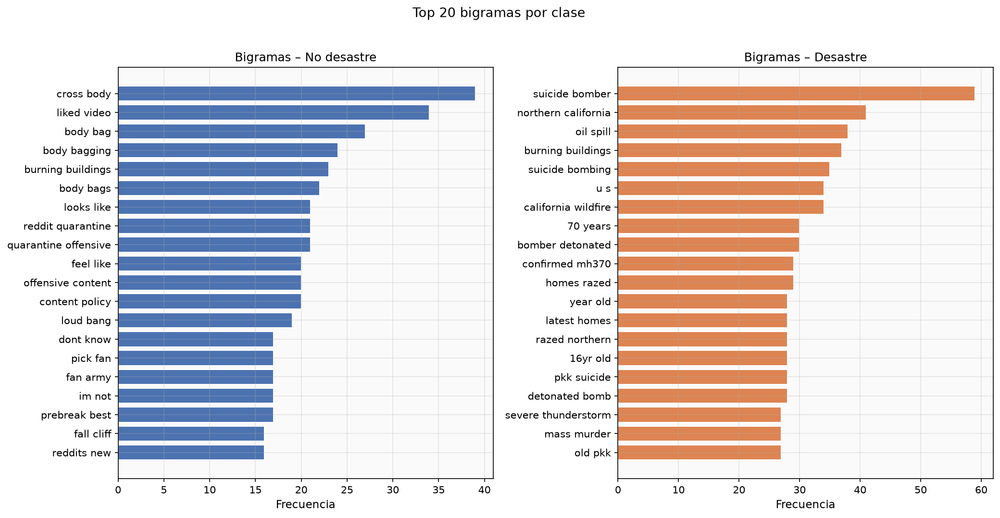

Los bigramas desambiguan mejor que los unigramas. Mientras *"fire"* es ambiguo como unigrama, *"northern california"* y *"california wildfire"* son fuertemente predictivos de desastre. *"suicide bomber"* (log-odds 4.15) y *"oil spill"* (3.02) son los mas distintivos.

Del lado de no-desastre, *"cross body"* (log-odds -2.95) y *"liked video"* (-1.43) son los mas distintivos.

Ver tabla completa: `outputs/eda/tables/bigrams_by_class.csv`.

### Trigramas

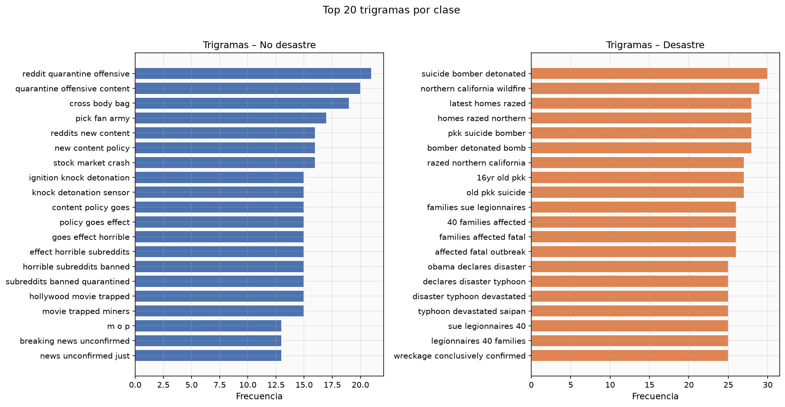

Los trigramas capturan frases completas como *"suicide bomber killed"* y *"northern california wildfire"*. Su frecuencia es menor pero su especificidad es alta.

Ver tabla completa: `outputs/eda/tables/trigrams_by_class.csv`.

## 6. Nubes de palabras

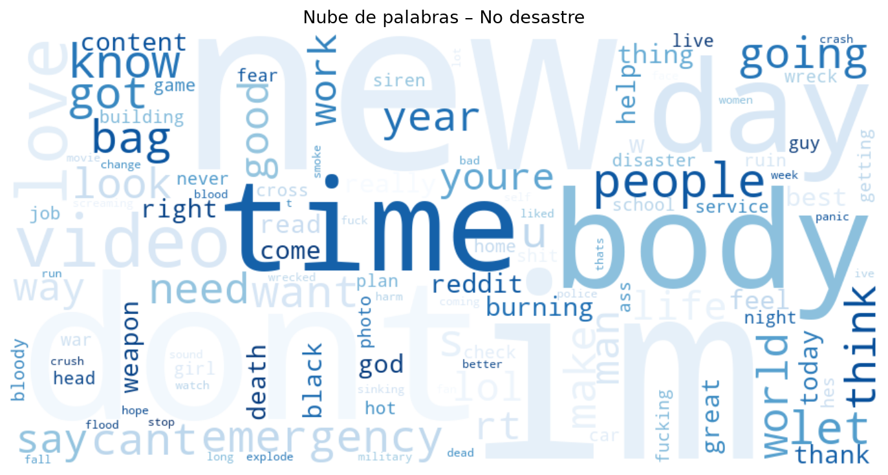

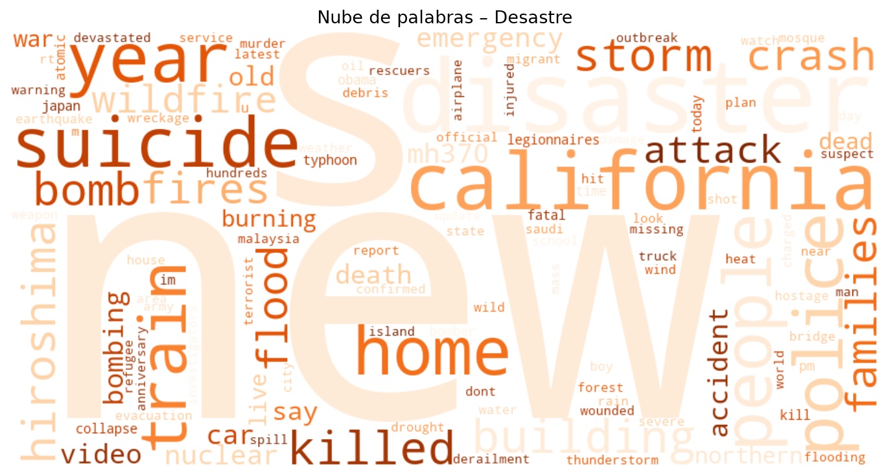

El tamano de las palabras representa su frecuencia dentro de la clase, **no su capacidad predictiva**. Palabras grandes en ambas nubes (como *"people"*) no son necesariamente discriminantes. Las nubes ilustran el vocabulario dominante pero deben interpretarse junto con los log-odds ratios de la seccion 5.

## 7. Prevencion de fuga de datos

### Problema

El dataset contiene tweets duplicados y cuasi-duplicados con etiquetas potencialmente diferentes. Si copias del mismo texto caen en train y holdout, el modelo memoriza texto exacto y el F1 reportado es artificialmente alto.

### Solucion: splits agrupados

Se define cada grupo como el texto normalizado (`text.strip().lower()`). Se utiliza `StratifiedGroupKFold` para garantizar que:

1. Todas las copias del mismo texto permanecen juntas (en dev o en holdout, nunca repartidas).
2. La proporcion de clases se preserva en ambos conjuntos.

Segun el manifiesto persistido (`outputs/models/split_manifest.json`):

| Conjunto | Filas | target=0 | target=1 | Grupos |
|----------|-------|----------|----------|--------|
| Dev | 6,090 | 3,473 | 2,617 | 6,003 |
| Holdout | 1,523 | 869 | 654 | 1,499 |

**Grupos compartidos entre dev y holdout: 0.** Esto confirma que no hay fuga.

## 8. TF-IDF y representacion del texto

### TF-IDF de palabras

Se usa `TfidfVectorizer` con n-gramas (1,2), `min_df=2`, `max_df=0.95`, y `sublinear_tf=True` (aplica `1 + log(tf)` para reducir el impacto de frecuencias extremas).

El contexto se captura parcialmente a traves de bigramas. Sin embargo, TF-IDF es una representacion *bag-of-words* que ignora el orden y las dependencias a larga distancia.

### TF-IDF de caracteres

`LogReg_char` usa `analyzer="char_wb"` con n-gramas (3,5). Los n-gramas de caracteres capturan:

 Subpalabras y morfemas (e.g., *"tion"*, *"kill"*).
 Variantes ortograficas y errores de tipeo frecuentes en tweets.
 Robustez ante tokenizacion imperfecta.

### Limitacion de TF-IDF respecto al contexto

TF-IDF no distingue *"not a disaster"* de *"a disaster"* si ambas palabras estan presentes. Los bigramas mitigan parcialmente esto, pero el contexto completo requeriria modelos secuenciales (LSTM, Transformers) que estan fuera del alcance de este laboratorio.

## 9. Modelos, hiperparametros y seleccion

### Modelos comparados

| Modelo | Descripcion | Hiperparametros buscados |
|--------|-------------|--------------------------|
| Dummy | Clase mayoritaria (baseline) | Ninguno |
| LogReg | Regresion Logistica con TF-IDF (1,2) | C: {0.5, 1.0, 5.0}, max_df: {0.9, 0.95} |
| ComplementNB | Complement Naive Bayes | alpha: {0.5, 1.0, 2.0}, max_df: {0.9, 0.95} |
| LinearSVC | SVM lineal calibrado (CalibratedClassifierCV) | C: {0.5, 1.0, 5.0}, max_df: {0.9, 0.95} |
| LogReg_char | LogReg con n-gramas de caracteres (3,5) | C: {0.5, 1.0, 5.0} |

### Validacion cruzada

Se uso `StratifiedGroupKFold` con 5 folds, los mismos grupos definidos en la seccion 7. La busqueda de hiperparametros se realizo con `GridSearchCV` optimizando F1(target=1).

### Resultados CV (dev, n=6,090)

| Modelo | Mejor params | F1 desastre | PR-AUC | ROC-AUC | Precision | Recall |
|--------|-------------|-------------|--------|---------|-----------|--------|
| LogReg_char | C=0.5 | 0.7631 | 0.8591 | 0.8642 | 0.7752 | 0.7512 |
| LogReg | C=5.0, max_df=0.9 | 0.7541 | 0.8501 | 0.8584 | 0.7681 | 0.7405 |
| LinearSVC | C=0.5, max_df=0.9 | 0.7516 | 0.8433 | 0.8563 | 0.7899 | 0.7169 |
| ComplementNB | alpha=0.5, max_df=0.9 | 0.7436 | 0.8520 | 0.8518 | 0.8125 | 0.6855 |
| Dummy | --- | 0.0 | 0.4297 | 0.5 | 0.0 | 0.0 |

**Modelo seleccionado:** `LogReg_char` (F1 CV = 0.7631, mayor entre todos los modelos).

Los n-gramas de caracteres superan a los de palabras por su robustez ante variaciones ortograficas tipicas de tweets.

## 10. Evaluacion en holdout

La evaluacion en holdout se realizo **una unica vez** con el modelo seleccionado, sin ajustar parametros ni umbral.

### Metricas holdout (n=1,523)

| Metrica | Valor |
|---------|-------|
| F1 (desastre) | 0.7894 |
| Precision | 0.8057 |
| Recall | 0.7737 |
| Accuracy | 0.8227 |
| F1 macro | 0.8182 |
| PR-AUC | 0.8786 |
| ROC-AUC | 0.8784 |

El F1 holdout (0.7894) es superior al F1 CV (0.7631), lo que indica que el modelo generaliza bien y no hay sobreajuste.

### Matriz de confusion

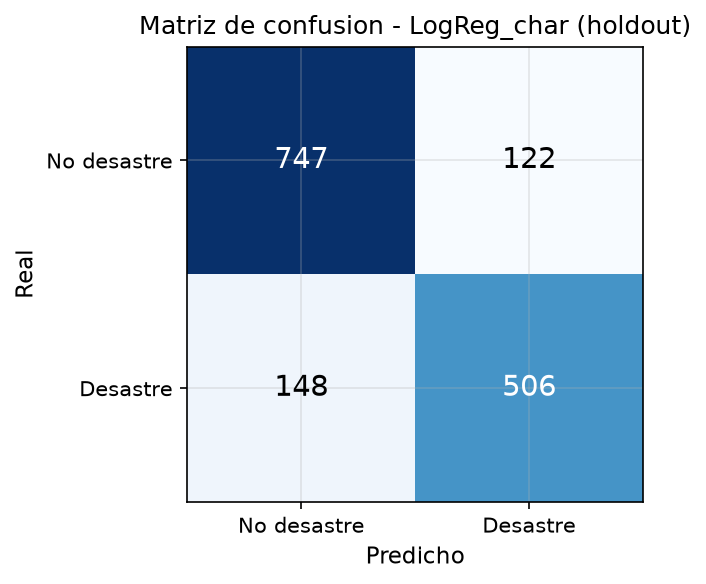

### Curvas PR y ROC

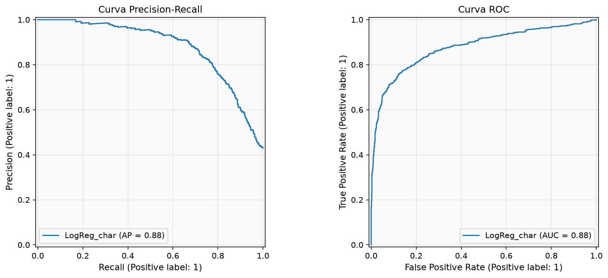

La curva PR muestra un PR-AUC de 0.8786, indicando buena separacion entre clases incluso bajo desbalance. La curva ROC confirma un ROC-AUC de 0.8784.

### Analisis de errores

**Falsos positivos** (predichos como desastre pero no lo son): tweets que usan vocabulario de desastre en sentido figurado. Ejemplo: *"there was an accident and some truck spilt mayonnaise all over"* contiene *"accident"* pero se refiere a un incidente menor y humoristico.

**Falsos negativos** (desastres no detectados): tweets con lenguaje indirecto o metaforico. Ejemplo: *"@willienelson We need help! Horses will die!"* describe una emergencia real pero sin palabras clave tipicas de desastre.

Ver muestras en `outputs/models/false_positives.csv` y `outputs/models/false_negatives.csv`.

## 11. Funcion de clasificacion

```python
from analisis_lab5 import clasificar_tweet
result = clasificar_tweet("Earthquake hits California, buildings collapsed")
# {'clase': 1, 'interpretacion': 'Desastre', 'score': 0.92, 'score_tipo': 'probabilidad'}
```

La funcion carga el pipeline guardado (`best_pipeline.joblib`), aplica la limpieza interna, vectoriza y clasifica. Retorna la clase predicha, su interpretacion, el score de confianza y el tipo de score.

## 12. Analisis de sentimiento (VADER)

### Metodologia

Se aplico VADER (Valence Aware Dictionary and sEntiment Reasoner) sobre el texto **original sin limpiar**, preservando mayusculas, negaciones, puntuacion y emoticonos. Se uso la implementacion `vaderSentiment` para evitar descargas externas del lexico.

### Variables generadas por tweet

 Scores `neg`, `neu`, `pos`, `compound`.
 Etiqueta: positiva si `compound >= 0.05`, negativa si `compound <= -0.05`, neutra en otro caso.
 `negativity`: igual al score `neg`.
 Conteos de tokens reconocidos como positivos y negativos por el lexico VADER. Los tokens no reconocidos por el lexico se describen como *sin polaridad reconocida*, no como neutros.

### Distribucion de sentimiento

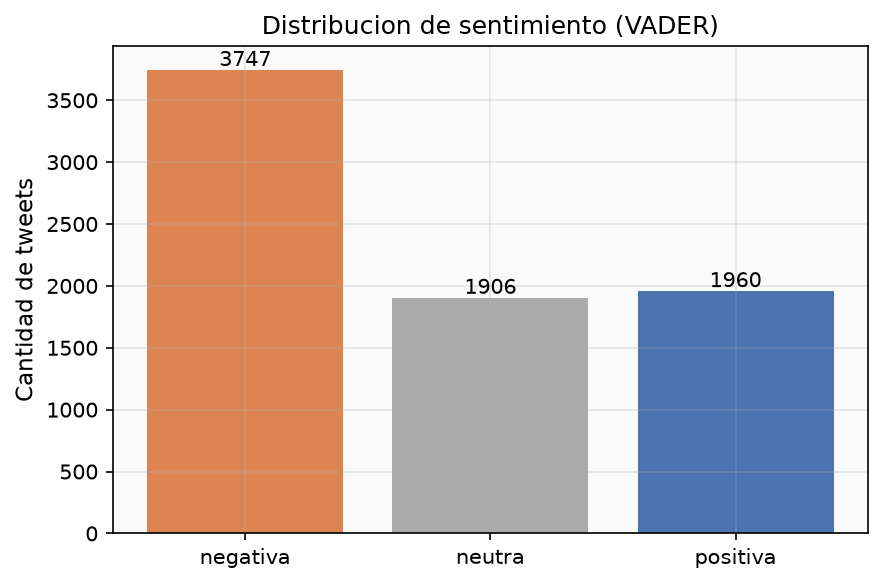

| Sentimiento | Desastre | No desastre |
|-------------|----------|-------------|
| Negativa | 1,890 | 1,857 |
| Neutra | 846 | 1,060 |
| Positiva | 535 | 1,425 |

Los tweets de desastre concentran mayor proporcion de sentimiento negativo y menor de positivo. Los no-desastre tienen mas tweets positivos, consistente con su naturaleza conversacional.

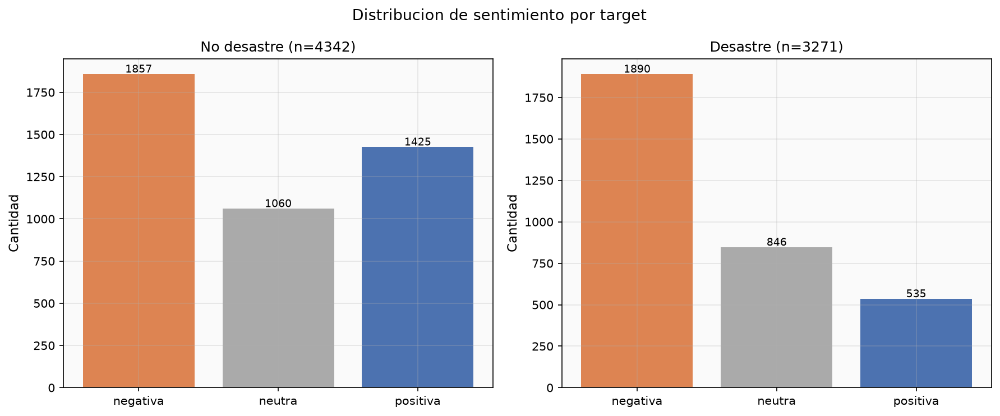

### Distribuciones de scores

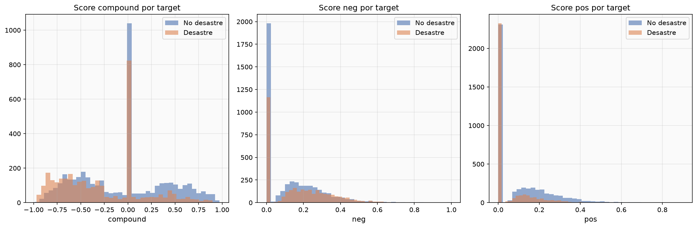

### Diez tweets mas negativos (unicos por texto normalizado)

| id | compound | target | Texto (truncado) |
|----|----------|--------|-----------------|
| 10689 | -0.9883 | No desastre | wreck? wreck wreck wreck wreck wreck... |
| 9172 | -0.9686 | Desastre | Suicide bomber targets Saudi mosque at least 13 dead... |
| 9166 | -0.9623 | Desastre | Suicide bomber kills 15 in Saudi security site mosque... |
| 9137 | -0.9595 | Desastre | 19th Day Since 17-Jul-2015 -- Nigeria: Suicide Bomb Attacks... |
| 9782 | -0.9556 | No desastre | @dramaa_llama but otherwise i will stay trapped... |
| 9159 | -0.9552 | Desastre | 17 killed in Saudi Arabia mosque suicide bombing... |
| 4213 | -0.9549 | No desastre | at the lake *sees a dead fish*... |
| 682 | -0.9538 | Desastre | illegal alien released by Obama/DHS... Charged With Rape & Murder... |
| 2225 | -0.9524 | Desastre | Bomb Crash Loot Riot Emergency Pipe Bomb Nuclear... |
| 9940 | -0.9493 | Desastre | @cspan #Prez. Mr. President you are the biggest terrorist... |

Ver tabla completa: `outputs/sentiment/top10_negative.csv`.

### Diez tweets mas positivos (unicos por texto normalizado)

| id | compound | target | Texto (truncado) |
|----|----------|--------|-----------------|
| 10028 | 0.9730 | No desastre | Check out 'Want Twister Tickets AND A VIP EXPERIENCE...' |
| 9345 | 0.9564 | No desastre | I feel like accidents are just drawn to you but I'm happy... |
| 8989 | 0.9471 | Desastre | Today's storm will pass; let tomorrow's light greet you... |
| 8136 | 0.9428 | No desastre | pets r like part of the family. I love animals... |
| 4541 | 0.9423 | No desastre | we enjoyed the show today. Great fun... |
| 9710 | 0.9394 | No desastre | Maaaaan I love Love Without Tragedy by @rihanna... |
| 8994 | 0.9376 | No desastre | Free Ebay Sniping... Excellent Condition!! |
| 1453 | 0.9345 | No desastre | I'm not a Drake fan but I enjoy seeing him body-bagging... |
| 9386 | 0.9344 | No desastre | yeah we survived 9 seasons and 2 movies... |
| 8759 | 0.9300 | No desastre | Super sweet and beautiful :) |

Ver tabla completa: `outputs/sentiment/top10_positive.csv`.

Los tweets mas negativos incluyen tanto desastres reales (bombas suicidas, asesinatos) como no-desastres con vocabulario negativo (repeticion de *"wreck"*, expresiones coloquiales de frustracion). Los mas positivos son abrumadoramente no-desastres; el unico desastre (id 8989, compound 0.9471) es un mensaje esperanzador sobre una tormenta, no un reporte factual.

### Prueba Mann-Whitney

**H0:** la negatividad (`neg` score) de los tweets de desastre no es mayor que la de los no-desastre.

| Estadistico | Valor |
|-------------|-------|
| U | 8,192,987.5 |
| p-valor | 4.20e-33 |
| r (rank-biserial) | +0.1537 (r > 0 indica mayor negatividad en desastres) |
| Tamano del efecto | Pequeno |
| Mediana neg desastre | 0.1570 |
| Mediana neg no-desastre | 0.0950 |
| Media neg desastre | 0.1727 |
| Media neg no-desastre | 0.1305 |

**Interpretacion:** La diferencia es estadisticamente significativa (p < 0.001), pero el tamano del efecto es pequeno (r = 0.1537). Esto significa que, aunque los tweets de desastre tienen en promedio mayor negatividad lexica, la diferencia es modesta y hay amplio solapamiento entre las distribuciones. **Significancia estadistica no implica gran utilidad practica:** con 7,613 observaciones, incluso diferencias triviales pueden alcanzar significancia. El rank-biserial r = 0.15 indica que la negatividad VADER por si sola no es un discriminador fuerte entre clases.

VADER no comprende contexto ni ironia. Un tweet como *"wreck wreck wreck"* (id 10689, target=0) recibe el score mas negativo del dataset, pero no describe un desastre real. VADER detecta valencia lexica, no semantica situacional.

## 13. Ablacion con negatividad

### Diseno del experimento

Se comparo el pipeline exacto de `LogReg_char` (C=0.5) contra el mismo pipeline mas una unica feature numerica `negativity` (score `neg` de VADER). La ablacion es preespecificada:

 Mismos IDs y grupos.
 Mismos 5 folds de CV.
 Mismos hiperparametros (C=0.5, sin ajuste adicional).
 Mismo holdout.
 La unica diferencia es la presencia/ausencia de la variable de negatividad.

No se ajusto parametros ni umbral con el holdout.

### Resultados

| Modelo | CV F1 | CV PR-AUC | Holdout F1 | Holdout PR-AUC |
|--------|-------|-----------|------------|----------------|
| LogReg_char | 0.7631 | 0.8591 | 0.7894 | 0.8786 |
| LogReg_char + negativity | 0.7544 | 0.8557 | 0.7870 | 0.8765 |
| **Delta** | **-0.0087** | **-0.0034** | **-0.0024** | **-0.0021** |

### Conclusion

Agregar negatividad no mejoro el clasificador: F1 disminuyo 0.0087 en CV y 0.0024 en holdout. El deterioro es pequeno, pero consistente; se conserva LogReg_char sin negatividad.

La explicacion probable es que la informacion que `negativity` aporta ya esta parcialmente capturada por los n-gramas de caracteres (que detectan subpalabras como *"kill"*, *"dead"*, *"bomb"*), y anadir una feature numerica escalar a una representacion TF-IDF de alta dimensionalidad introduce mas ruido que senal.

## 14. Conclusiones, limitaciones y recomendaciones

### Conclusiones

1. `LogReg_char` con n-gramas de caracteres (3,5) y C=0.5 es el mejor modelo, con F1(desastre) = 0.7894 en holdout y PR-AUC = 0.8786.
2. Los n-gramas de caracteres superan a los de palabras, capturando variantes ortograficas frecuentes en tweets.
3. Los splits agrupados por texto normalizado eliminan la fuga de datos por duplicados, produciendo metricas honestas.
4. El sentimiento VADER muestra diferencia estadisticamente significativa entre clases (p < 0.001), pero el tamano del efecto es pequeno (r = 0.15).
5. Agregar negatividad VADER al modelo no mejora el F1; la senal ya esta capturada por los n-gramas.

### Limitaciones

 TF-IDF no captura orden ni dependencias a larga distancia.
 VADER es un analizador lexico: no comprende contexto, ironia ni sarcasmo.
 El dataset contiene etiquetas ruidosas (16 grupos contradictorios) que imponen un techo al rendimiento.
 No se realizo validacion humana de las etiquetas originales ni de las predicciones.
 Los resultados son especificos a tweets en ingles sobre desastres; la generalizacion a otros dominios o idiomas no esta garantizada.

### Recomendaciones

 Explorar modelos secuenciales (LSTM, Transformers) para capturar contexto.
 Investigar si la limpieza de etiquetas contradictorias mejora el rendimiento.
 Evaluar features de sentimiento mas sofisticadas (e.g., sentimiento por oracion, emociones discretas).
 Considerar ensambles que combinen multiples representaciones del texto.

## 15. Bibliografia

1. Kaggle. *Natural Language Processing with Disaster Tweets*. https://www.kaggle.com/c/nlp-getting-started
2. Hutto, C.J. & Gilbert, E.E. (2014). VADER: A Parsimonious Rule-based Model for Sentiment Analysis of Social Media Text. *Proceedings of the Eighth International AAAI Conference on Weblogs and Social Media (ICWSM-14)*.
3. Jurafsky, D. & Martin, J.H. (2024). *Speech and Language Processing* (3rd ed. draft). https://web.stanford.edu/~jurafsky/slp3/
4. Pedregosa, F. et al. (2011). Scikit-learn: Machine Learning in Python. *Journal of Machine Learning Research*, 12, 2825-2830. Documentacion: https://scikit-learn.org/stable/
5. Universidad del Valle de Guatemala, CC3084 Data Science. *Laboratorio 5: Mineria de Textos y analisis de sentimiento*. Guia del laboratorio, Semestre II 2026.
